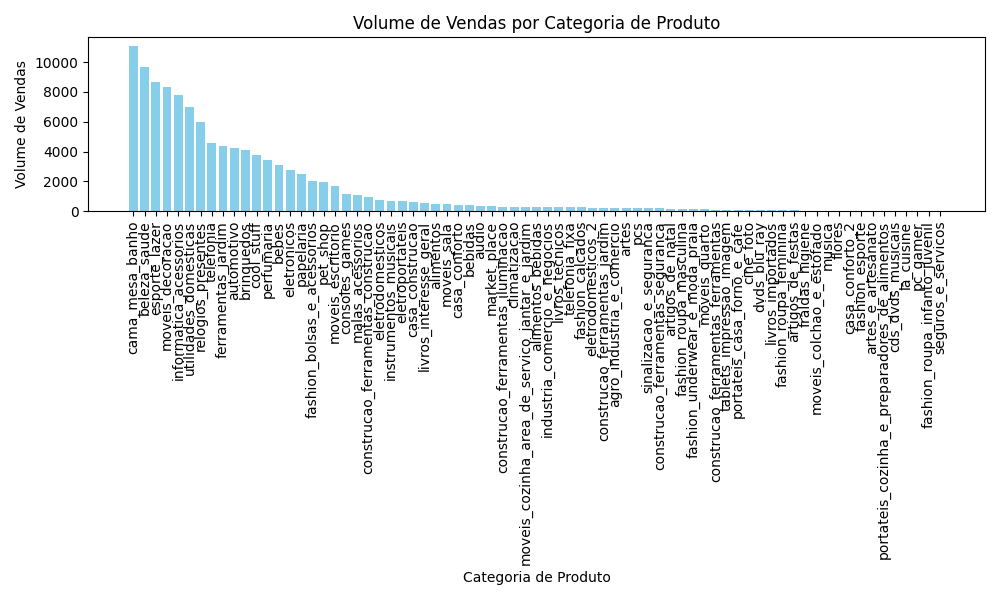
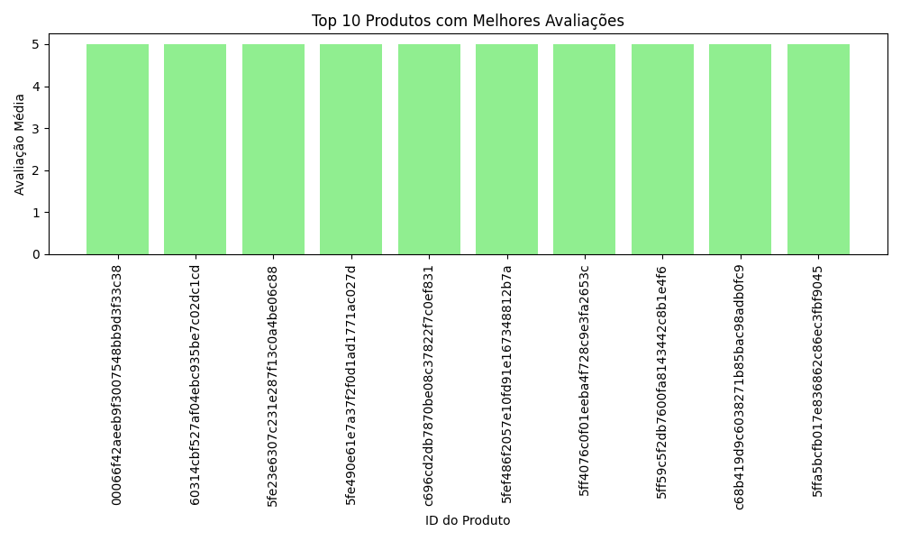
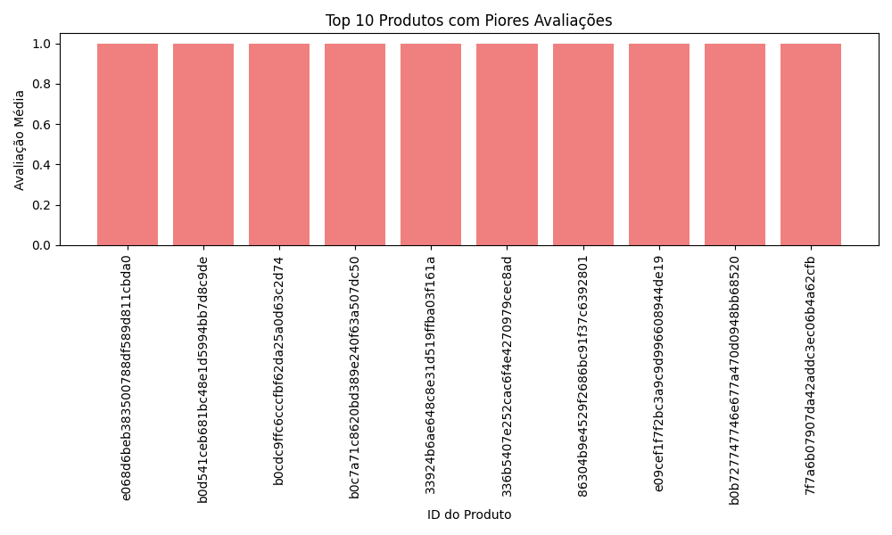
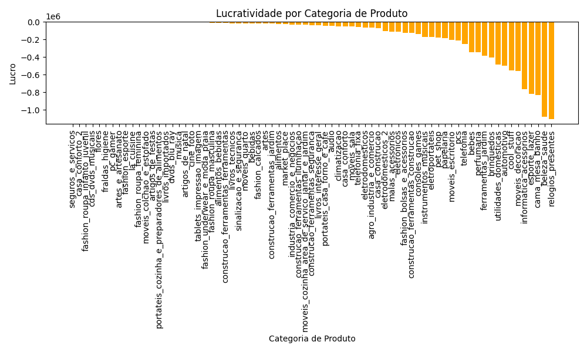
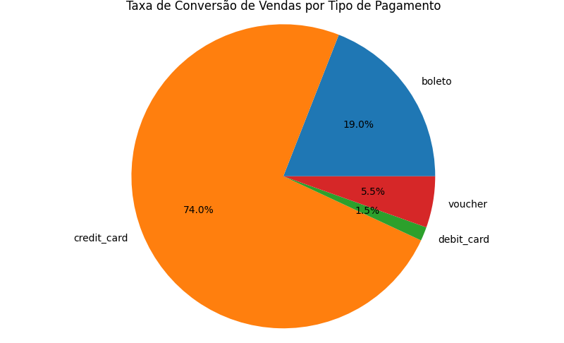

# Análise de Dados do E-Commerce Brasileiro
Este desafio consiste em uma análise de dados do E-Commerce Brasileiro utilizando Python. O objetivo é realizar análises em diferentes áreas, como vendas, logística, satisfação do cliente, finanças e marketing, a fim de extrair insights e tomar decisões informadas.

## Requisitos
Para executar este projeto, é necessário ter o Python instalado em seu sistema. Além disso, as seguintes bibliotecas Python devem ser instaladas:

- pandas
- matplotlib

Você pode instalar essas bibliotecas usando o pip. 

Execute o seguinte comando no terminal:

```bash
pip install pandas matplotlib
```

### Como Executar
Faça o download de todos os arquivos deste repositório.
Certifique-se de ter os requisitos mencionados acima instalados em seu ambiente Python.
Execute o arquivo dados.py em seu ambiente Python. 

Isso pode ser feito através do terminal usando o comando:
```bash
python dados.py
```
O script irá gerar gráficos para cada seção da análise. Os gráficos serão exibidos na janela do seu navegador padrão.

Abaixo estão os tópicos escolhidos para fazer o desafio:

### 1. Análise de Performance de Vendas
a. Volume de Vendas por Categoria: Identificar quais categorias de produtos têm o maior volume de vendas e em quais períodos (mensal, trimestral).

Os dados são exibidos no terminal e também podem ser visualizados no gráfico abixo:



### 2. Análise de Logística
a. Prazos de Entrega: Calcular o tempo médio de entrega e identificar os fatores que influenciam atrasos nas entregas.

Nesta seção, foi calculado o tempo médio de entrega dos produtos. O resultado foi exibido no terminal.

### 3. Análise de Satisfação do Cliente
a. Avaliações de Produtos: Analisar a distribuição das avaliações dos produtos e identificar os produtos com as melhores e piores avaliações.

Aqui, foi realizada uma análise das avaliações dos produtos. Os gráfico abaixo mostram os 10 produtos com as melhores e piores avaliações.




### 4. Análise Financeira
a. Análise de Lucratividade por Categoria: Calcular a lucratividade de diferentes categorias de produtos, levando em conta o custo dos produtos e o preço de venda.

Nesta seção, foi feita uma análise da lucratividade por categoria de produto. O gráfico abaixo mostra a lucratividade para cada categoria.



### 5. Análise de Marketing
a. Análise de Conversão de Vendas: Estudar a taxa de conversão de vendas com base em diferentes fontes de tráfego (orgânico, pago, social, etc.).

Foi estudada a taxa de conversão de vendas com base em diferentes fontes de tráfego. Os resultados foram exibidos no terminal.

